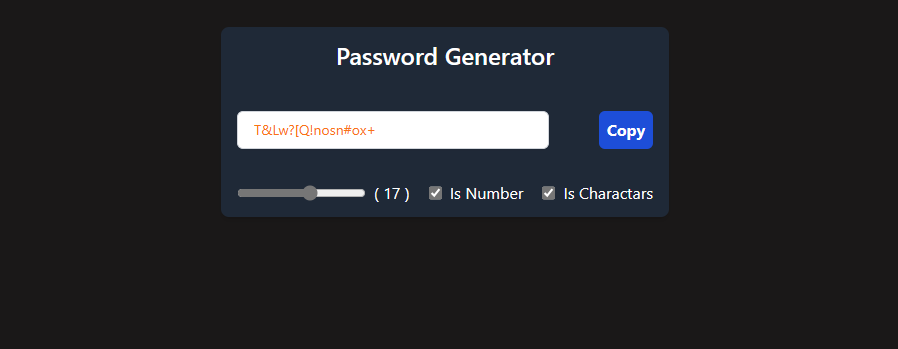

 # Password Generator

This is a simple React component that generates a random password based on the user's input. The user can specify the length of the password, whether or not to include numbers, and whether or not to include special characters.

  
 

The component accepts the following props:

* `length`: The length of the password to generate.
* `numberAllowed`: A boolean value that indicates whether or not to include numbers in the password.
* `charAllowed`: A boolean value that indicates whether or not to include special characters in the password.
 
## Code Explanation

The component uses the `useState` hook to manage the state of the component. The state consists of the following properties:

* `length`: The length of the password to generate.
* `numberAllowed`: A boolean value that indicates whether or not to include numbers in the password.
* `charAllowed`: A boolean value that indicates whether or not to include special characters in the password.
* `password`: The generated password.

The component also uses the `useEffect` hook to generate a new password whenever the length, numberAllowed, or charAllowed properties change.

The `passwordGenerator` function is used to generate a new password. The function first creates a string of all the possible characters that can be used in the password. This string includes the uppercase and lowercase letters of the alphabet, the numbers 0-9, and the special characters `~!@#$%^&*()_+{}[]:<>,./?`.

The function then uses a `for` loop to generate the password. For each character in the password

 